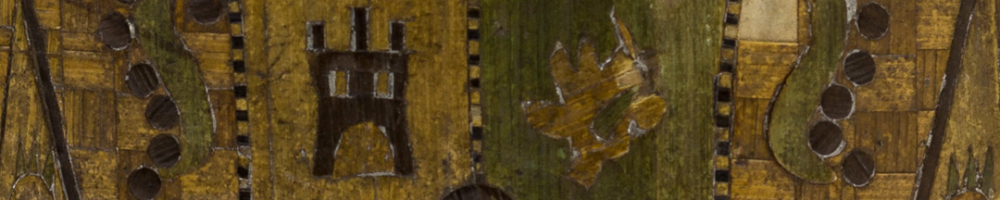
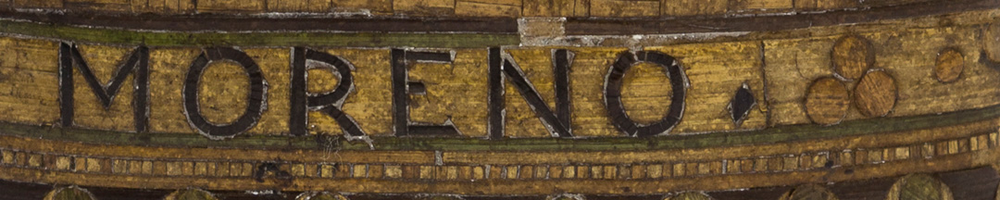

Moreno era muy crítico de la monarquía y quería instalar un gobierno representativo de la voluntad popular. En La Gazeta, el periódico que fundó para difundir las ideas del gobierno revolucionario, sostuvo que todos amaban a Fernando VII pero que en realidad los derechos de la monarquía española en América eran ilegítimos, ya que la conquista se hizo por la fuerza, y nunca se le había dado poder por el consentimiento libre y unánime de los pueblos americanos, por lo que no se le debía obediencia. Ahí estaba esbozada la idea de romper los vínculos con España y su rey, para volverse independientes.

Esta cigarrera perteneció a Moreno. Tiene la inscripción de su nombre, su título profesional y su status de español americano: Doctor –en leyes–, y Don. Contiene también una inscripción política: “Fernando VII - Viva el Rey”, y el escudo de armas de la corona española. Seguramente la adquirió antes de 1810.

En la primera etapa de la Revolución, Belgrano estuvo cerca de las ideas de Moreno.

### Un mundo globalizado
La cigarrera nos muestra los contactos culturales generados por el comercio y por las guerras. Este tipo de artesanía se desarrolló en Asia, especialmente en Filipinas, y luego en distintos puntos de Europa. Es una estructura de madera recubierta por marquetería en paja y luego barnizada. Se especializaron también en este arte muchos de los prisioneros de los ejércitos napoleónicos, como un pasatiempo en las cárceles inglesas.

Por otro lado, el tabaco que se consumía en el Río de la Plata se cultivaba en Paraguay y se comercializaba como monopolio de la corona española. Entre las elites se consumía en polvo o rapé, aspirándolo por la nariz; y como cigarros. Y entre las clases populares en un picado grueso, conocido como hechizo, para armar.

### ¿Querés saber más?
El uso de las tabaqueras con este arte fue una moda que duró hasta varias décadas después de la muerte de Moreno, y en ellas se expresaron los cambios y las ideas políticas. Hay otra cigarrera del mismo tipo en la colección, con el nombre inscripto del Doctor Don Felipe Arana, revolucionario, diputado de Buenos Aires, y representante ante el exterior durante el gobierno de Rosas. En ella, en vez del escudo de la corona española, se ve el escudo nacional. Otra tabaquera similar con leyendas federales y rosistas se conserva en el Museo López, de Santa Fe.

### Datos del objeto
Cigarrera que perteneció a Mariano Moreno. Su estructura es de madera recubierta por marquetería en paja tejida, coloreada y barnizada. En la parte superior dice: "Fernando VII". En el centro el escudo español y en la parte inferior "Del D. D. Mariano Moreno".
Mide 11,5 centímetros de alto por 6 centímetros de ancho.

