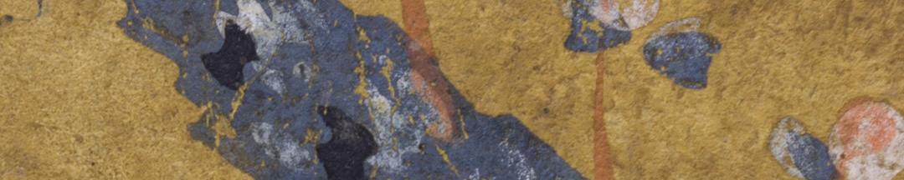
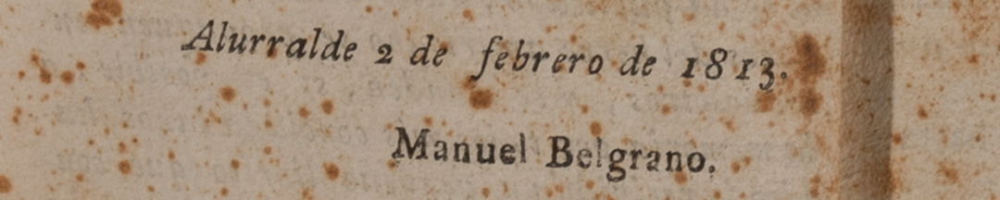

Se trata de un mensaje de George Washington, general de la guerra de independencia de Estados Unidos de América y primer presidente de ese país, escrito a modo de carta a los ciudadanos, en el que comunicó la decisión de no continuar por un tercer mandato en la presidencia, como le fue ofrecido.

Se publicó por primera vez en septiembre de 1796, y es una declaración clásica sobre el republicanismo y sus ideas acerca del gobierno. Defendía la Constitución al afirmar que el sistema de controles, equilibrios y la separación de poderes eran la clave para la libertad y la felicidad de la nación.

Este es un ejemplar del libro con el discurso de Washington traducido por Manuel Belgrano y Joseph Redhead, su médico personal. Se publicó en Buenos Aires en 1813. Belgrano consideraba que era útil e inspirador, una incitación a terminar con la tiranía española en el Río de la Plata, y por eso impulsó que se leyera este “*librito*”, como lo llamó.

### Una traducción accidentada
Belgrano comenzó la traducción de este libro en 1811, en la campaña militar que comandó al Paraguay para obligarlo a aceptar a la junta formada en Buenos Aires. Pero fue derrotado y en la batalla de Tacuarí sus papeles se perdieron, víctimas de un incendio.

En 1812 llegó otro ejemplar del discurso a sus manos, y le encargó a Redhead, que manejaba el inglés, su traducción. En plena campaña militar, como general del Ejército Auxiliar del Perú, el 2 febrero de 1813, Belgrano firmó el prólogo de la traducción desde Alurralde, una posta en el camino entre Tucumán y Salta. Belgrano quiso dar a conocer este texto para que fuera leído y estudiado, tomado como ejemplo para “*constituirnos en nación libre e independiente*”.

### ¿Querés saber más?
Este ejemplar del discurso de despedida de George Washington que se conserva en la colección del MHN perteneció al cura *Padre Ministro González*. Está encuadernado y su tapa fue decorada y pintada manualmente. Belgrano, que se convirtió en revolucionario, no dejó nunca de ser creyente y católico, no es casual que una de las ideas centrales de la carta de Washington es la importancia de la religión y la moral, como base de la felicidad y prosperidad política de la nación. Sostiene que los principios religiosos promueven la protección de la propiedad, la reputación y la vida, que son los cimientos de la justicia y la unidad social.

### Datos del objeto
*Despedida de Washington al pueblo de los Estado Unidos*. Este libro de pequeñas dimensiones fue encuadernado y publicado en Buenos Aires en 1813. Su tapa decorada y pintada a mano. En el interior de su portada figura el nombre de su dueño: “*Padre Ministro González*”.

