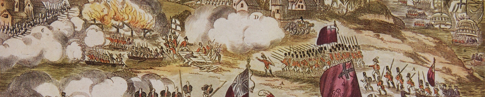
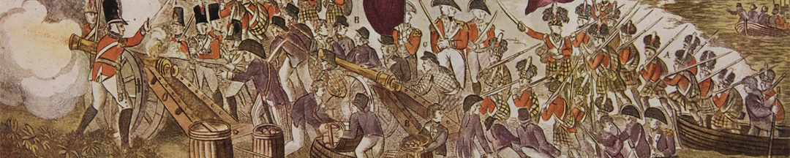

La gloriosa conquista de Buenos Aires por las fuerzas británicas es una entre muchas imágenes que circulaban y construían relatos. Así, las personas conocían y recordaban los eventos más significativos de sus tiempos: batallas, naufragios, funerales y hasta actividades de la vida cotidiana.

Probablemente inspirada en los relatos de quienes regresaban de América, esta escena representa en sucesivos planos la toma de la ciudad de Buenos Aires en junio de 1806, durante la primera invasión inglesa. Por eso se ven distintos grupos de hombres descargando armamento, formándose, disparando e incluso iniciando incendios camino al Fuerte.

Su autor es George Thompson, un grabador e impresor de Londres, y se trata de una xilografía coloreada a mano.

### Un paisaje diferente
La geografía a la que llegaron las tropas británicas aparece como ondulada, llena de vegetación y con edificaciones irregulares. Más allá de algunas licencias que se tomó el autor, y aunque a nuestros ojos parece exótica, lo cierto es que la ribera de Buenos Aires tenía más parecido a esta representación de lo que hoy podemos ver.

Es que debajo del asfalto y los edificios se esconde un relieve ondulado que en otras épocas estaba cubierto por plantas. Buenos Aires, además, no era un puerto de aguas profundas. Se había emplazado sobre barrancas y en la proximidad de las aguas bajas para evitar un ataque naval desde el río. Quizás por eso las tropas británicas del grabado se aproximan a la costa en pequeñas embarcaciones y descargan a mano las armas dejando atrás los buques de guerra. En realidad, desembarcaron en Quilmes y avanzaron por tierra.

### ¿Querés saber más?
Más de la mitad de los hombres que llegaron durante las invasiones inglesas a las costas de Buenos Aires pertenecían al Regimiento 71 de Highlanders de infantería, de Escocia. En este grabado Thompson los representa en sus uniformes con sus típicos kilts –polleras– y morriones emplumados –cubrecabezas–.

Estos eran trajes típicos que llamaron la atención de los porteños y perduraron en sus recuerdos. Un soldado de la época escribió en su diario que el vestuario de estas tropas parecía el “vestido de un arlequino”. Cincuenta años después, al escribir sus memorias, la propia Mariquita Sánchez de Thompson se refirió a ellos como “las más lindas tropas que se podían ver, el uniforme más poético”.

### Datos del objeto
Toma de Buenos Aires (The Capture of Buenos Ayres 28th June, 1806) realizado por George Thompson. Utilizó la técnica del grabado coloreado a mano. Fue hecho sobre madera con la técnica de la xilografía, en Londres en 1806. Mide 19 centímetros de alto y 23,5 centímetros de ancho sin el marco.

