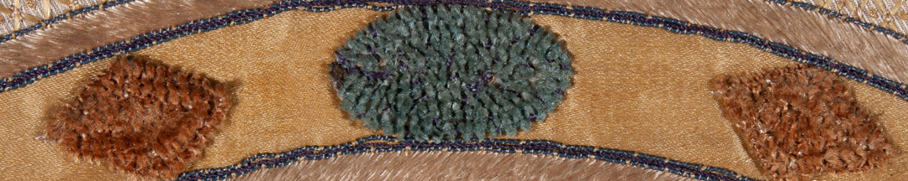
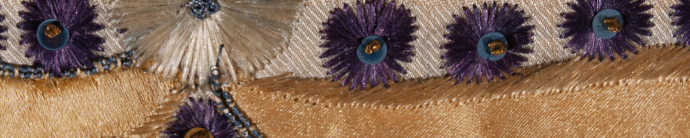

El comandante de los Gallegos fue Pedro Antonio Cerviño, que había llegado de Galicia en 1774 y desde 1799 era el director de la Escuela Náutica, puesto en el que fue designado por Belgrano, con quien compartía varios puntos de vista.

Cada unidad de la milicia tenía su reglamento. En el primer punto del reglamento de los Gallegos, Cerviño estableció el nombre oficial del grupo: *Tercio de Voluntarios de Galicia*, y la confección de dos banderas. El nombre *tercio* fue adoptado por todos los españoles. Así se llamaba en España a los grupos de defensa *cívica* de las ciudades. El nombre provenía de las famosas unidades de infantería españolas del siglo XVI.

Los cuerpos milicianos crearon sus insignias. Los escudos y banderas organizaban a los hombres y reforzaban su identidad. Cerviño mandó a hacer dos banderas para el tercio de Gallegos.

### ¿Querés saber más?
Cerviño y Belgrano compartieron opiniones durante muchos años en el Consulado de Buenos Aires, y por eso Belgrano lo confirmó en su puesto de director de Escuela Náutica en 1810. Ambos estaban en contra del comercio monopólico impuesto por España, defendían el librecambio y el desarrollo local. Además, eran fuertes defensores de las escuelas técnicas y profesionales del Río de la Plata.

Así, Cerviño decía en uno de sus discursos en 1799:

“La erección de escuelas merece el mayor aplauso, ellas ilustran a los moradores de la Patria y los despertarán del largo sueño que no les ha dejado pensar en sus verdaderas conveniencias; de la ilustración se debe esperar todo bien, como de la ignorancia un conjunto de males considerables, enséñese, pues, las ciencias y prosperará el país”.

### Datos del objeto
La bandera del tercio de gallegos está bordada en tafetán de seda. En su centro el escudo de armas del rey coronado y rodeado por el *toisón de oro*, un collar del que pende un cordero, rodeado por una rama de palma y otra de laurel, símbolos de gloria militar. En el escudo figuran las armas de los reinos de Castilla, León, Granada, y la flor de lis, emblema de la dinastía de los Borbones; estos dos últimos con hilos metálicos. En su reverso tiene una cruz que identifica al apóstol Santiago, cuyo santuario se encuentra en Galicia. Mide 1,50 metros de largo por 1,44 metros de ancho.

