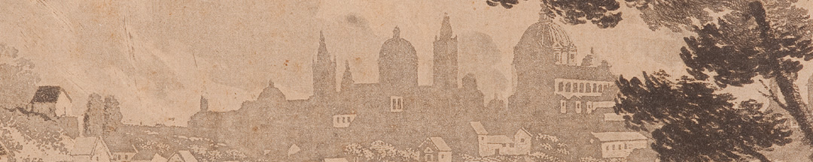
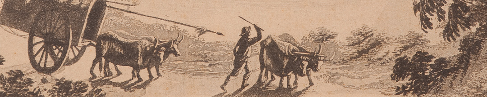

Como parte de las reformas que se iniciaron en el imperio español con el rey Carlos III,  buscando una mejor administración y aumentar la recaudación fiscal, se planificaron expediciones. La que llegó al Río de la Plata, al mando del marino italiano Alessandro Malaspina, se extendió desde 1789 a 1794, siguiendo las rutas de expediciones previas francesas e inglesas. Se propuso confeccionar cartas hidrográficas, es decir, mapas de los ríos y puertos marítimos, para guiar las rutas de navegación mercantil. A su regreso, Malaspina recomendó una “independencia moderada” de las colonias, por lo cual fue encarcelado y desterrado de España.

### Pintores aventureros
El dibujo de este grabado es atribuido al genovés Ferdinando de Brambilla y al español José Cardero, pintores topógrafos de la expedición científica de Malaspina. En la versión que se atribuye a Brambilla fue agregado un ombú, árbol típico de esta región. Brambilla se sumó a la expedición en 1791, viajando desde Génova a Acapulco. No se sabe si estuvo presente en la segunda visita a Buenos Aires en 1794 (la primera fue en 1789). Quizá se inspiró en los croquis de sus compañeros que se internaron en el territorio. Las academias en Europa, donde se formaron estas figuras, pretendieron dar a los gremios artesanales y artistas particulares la enseñanza y aprendizaje de las artes con una impronta científica. Así empezó a desarrollarse el género de vistas y panoramas de puertos y ciudades.

### ¿Querés saber más?
Entre 1795 y 1798 se grabaron en España varias aguafuertes basadas en aguadas de resina copiadas de las vistas de Brambilla, con el objetivo de publicar un Atlas, que nunca se concretó. Aquí el grabador traspasó el dibujo en una plancha de cobre sin invertirla, entonces hizo que la vista tomada desde el Sur de la ciudad, apareciera como tomada desde el Norte. Este grabado fue reproducido por primera vez en 1809 con el título Vue de Buenos-Ayres en la Collection des Planches de los Voyages dans l'Amerique meridionale, obra de Félix de Azara, otro funcionario borbónico, militar y aficionado naturalista, a quien se encomendó delimitar una línea de frontera entre el imperio español y el portugués en el litoral y la mesopotamia, remontando los ríos afluentes de la cuenca del Plata.

### Datos del objeto
Vista de la ciudad de Buenos – Ayres en 1794 de Fernando Bambrilla. Este grabado fue ejecutado en Madrid. Mide 37 centímetros de alto por 28 centímetros de ancho.

