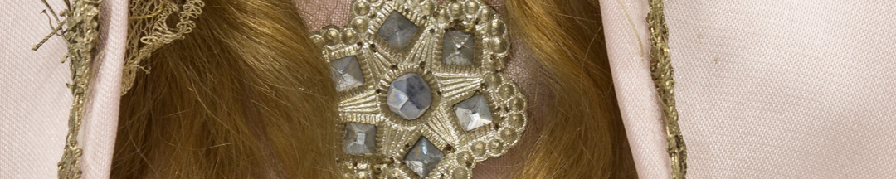

Desde antes se pedía la protección de distintas advocaciones de la Virgen para la guerra, y se le ofrecían trofeos tomados al enemigo. La novedad de Belgrano fue nombrar a la Virgen como generala. Era también una medida hábil para combatir el discurso de los contrarrevolucionarios, que acusaron a la primera expedición al Alto Perú comandada por Castelli de ser impía y atacar la religión.

Pezuela, general que enfrentó a Belgrano Vilcapugio y Ayohuma, hizo algo similar: nombró a la Virgen del Carmen patrona y generala de sus fuerzas. Cuando después de esas derrotas Belgrano le dejó el mando a San Martín, le aconsejó:
 "*La guerra, allí, no sólo la ha de hacer Usted con las armas, sino con la opinión, afianzándose siempre ésta en las virtudes morales, cristianas, y religiosas, pues los enemigos nos la han hecho llamándonos herejes*".

Esta es una *imagen de vestir* de la Virgen de La Merced. Las prácticas de devoción consisten en vestirlas con lujo y detalle para caracterizarlas, y así llevarlas en procesión o para colecta de limosna.

### ¿Querés saber más?

Algunos de los que estuvieron presentes en la batalla de Tucumán creyeron que la Virgen había intervenido en ella. El oficial Juan Pardo de Zela, recuerda en sus memorias:
“*cada soldado creyó ver en la indicada nube la redentora de sus fatigas y privaciones; cuya ilusión, aumentóse progresivamente, daba más fuerza a nuestra pequeña línea*”.

Felipa Zavaleta tucumana hija de un combatiente, relata de oídas:
“*Los mismos prisioneros enemigos decían que a la hora de la acción en la línea del ejército tucumano vieron una Señora vestida de blanco y que les batía el manto sobre los militares y que por eso las balas no les hacían nada*”.

Pastor Obligado relata que oyó del *negro tío Alejo*:
“*nos parecía oír allí el ruido de las polleritas de la Virgen, a quien nuestro General Belgrano nos aconsejaba encomendarnos, pues íbamos a pelear en el día de su fiesta. Los más sabios dijeron, sería alucinación, pero creo haberla visto pasar entre nubes de humo, recorriendo las filas*”.

### Datos del objeto
Armazón metálico articulado con manos y cara de madera tallada a mano, ojos de vidrio y cabellera de pelo natural. Mide 47 centímetros de alto y su vestimenta no es original. Aproximadamente es de 1810.

