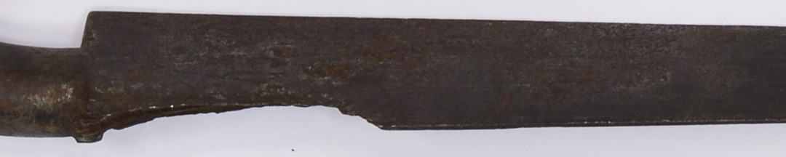

La infantería, los soldados de a pie, se formaba en líneas largas y sucesivas de soldados para que mientras una fila disparaba, las otras recargasen balas y pólvora. La precisión de los fusiles era muy poca y por eso se buscaba aumentar la cantidad de disparos simultáneos. Si el combate llegaba al cuerpo a cuerpo, y también para frenar a la caballería, se utilizaban las bayonetas.

Estas hojas metálicas afiladas con punta se ajustaban alrededor del cañón del fusil. La caballería empleaba sables y espadas, junto con pistolas y granadas. También se usaban lanzas hechas con cañas, a las que también se les podía encastrar bayonetas.

Las maniobras de infantería requerían mucho entrenamiento y organización. Tras la victoria en Tucumán, Belgrano comunicó al gobierno que cuando sonó la corneta indicando preparar el arma: 
“*Confieso que fue una gloria para mí ver que el resultado de mis lecciones a los infantes para acostumbrarlos a calar bayonetas, al oír aquel toque, correspondió a mis deseos*”.

### Datos del objeto

Esta bayoneta de hierro fue encontrada en una excavación arqueológica de principios del siglo XX en los túneles del que era el cuartel de Patricios en Buenos Aires. Mide 30 centímetros.

