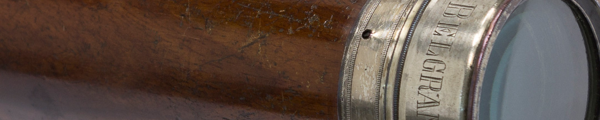
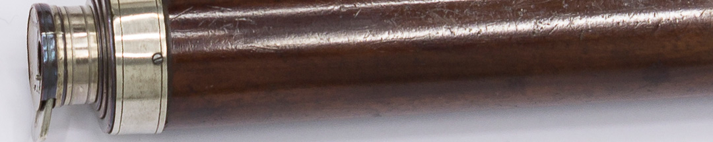

Primero dirigió una pequeña expedición para obligar a Paraguay a seguir a la junta instalada en Buenos Aires, pero fue derrotado en 1811. Entre 1812 y 1814 comandó el Ejército Auxiliar del Perú –también llamado Ejército del Norte–, con el que libró algunas de las batallas más importantes de la Guerra de Independencia: las victorias revolucionarias en Tucumán y Salta, y dos derrotas en el Alto Perú, la actual Bolivia, en Vilcapugio y Ayohuma. Condujo la retirada tras estos reveses y después dejó el mando.

El general no conocía el interior del territorio del virreinato y se reprochaba por esta falta cuando tuvo que recorrerlo comandando tropas. Como jefe se ocupó de administrar la logística y los recursos, y de redactar reglamentos para sus fuerzas. También se hizo tiempo para proyectar fundaciones de pueblos y de escuelas. Para Belgrano la guerra fue una oportunidad de hacer reales los cambios que deseaba en la sociedad.

Tras las derrotas que sufrió en el Alto Perú en 1813, un amargado Belgrano renegó de su cargo de general. Escribió: “*¿a qué nos hemos de engañar?, de dónde ni cómo había de ser Yo un General*”. Y agregó “*sólo serviré en la clase de Soldado, y jamás en la de Jefe: basta ya de sufrir*”.

### La herramienta del jefe
Los generales no solían tomar parte de la lucha en las batallas. Se colocaban a cierta distancia para tener una perspectiva lo más completa posible de lo que ocurría y tomar decisiones. Tanto en la planificación de un combate como en el día de la acción, el catalejo era un instrumento clave para estudiar el terreno, disponer las fuerzas, espiar a los enemigos y dirigir los movimientos. Gracias a los catalejos los jefes podían ser espectadores activos y enviar mensajeros con órdenes a los oficiales en el campo de batalla.

El *anteojo* de Belgrano, como él lo llamaba, es de origen inglés. A causa de la expansión marítima y colonial que desplegó desde el siglo XVIII, Inglaterra fue la sede de los más prestigiosos artesanos fabricantes de estos artefactos ópticos, fundamentales tanto para la navegación como para la guerra. Consiste en un mecanismo con mira y lentes, articulado por tres tubos metálicos encastrados. Cuando se despliegan mide casi un metro. Cuanto más largo era un catalejo, más poder de alcance visual. Su sistema imitaba al del telescopio que inventó Galileo Galilei para observar el cielo, dos siglos antes de la existencia de Belgrano.

### ¿Querés saber más?
En el estudio previo del terreno era importante la guía y el consejo de los *baqueanos*, como se llamaba a los paisanos conocedores del territorio, por ser del lugar y en muchos casos trabajar como arrieros, trasladando ganado y mercancías en largos viajes. Belgrano, en su memoria sobre la campaña al Paraguay, cuenta:
“*no tenía baqueanos que darles ni había quien me diese conocimiento del terreno, y sólo me dirigía por lo que veía con mi anteojo*”.

### Datos del objeto
El Catalejo tiene estructura de cobre y madera y ópticas de vidrio. Fue hecho en la Compañía londinense Gilbert & Co. Tiene 25 centímetros de largo y 4,3 centímetros de diámetro.

