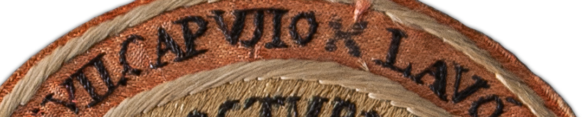
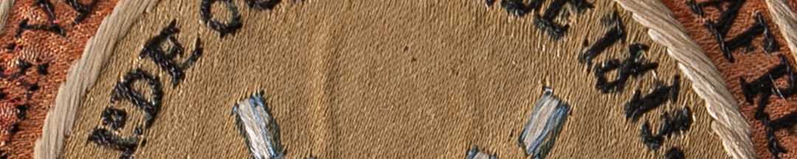

Dos de las banderas capturadas pertenecían al Batallón Fernando VII. A ese modelo se las conocía como batallonas. Llevaban sobre un campo de tafetán de seda blanco aplicada con costura la cruz aspada de Borgoña, en tafetán de seda rojo. En los extremos de la cruz están aplicados escudos bordados en hilos de seda con las iniciales de un lema.

Este es un escudo de honor otorgado por el ejército realista a los oficiales vencedores de la batalla de Vilcapugio. En su circunferencia, se lee "Lavó la afrenta del Tucumán y Salta en los llanos de Vilcapugio". En su centro está bordado un símbolo fuerte: un gorro frigio de la libertad atravesado por dos bayonetas, signo de la derrota revolucionaria.

En los ejércitos estos reconocimientos eran como un currículum visible del militar premiado con ellos. Se cocían en la manga izquierda de los uniformes y se iban acumulando con las victorias. Los escudos de paño concedidos por el ejército realista eran generalmente circulares, bordados con hilos de seda, a diferencia de los patriotas que solían ser ovalados, bordados con hilos metálicos.

### Datos del objeto
Escudo de paño de lana con bordados en hilos de seda, 1813. Mide 7 centímetros de diámetro.
