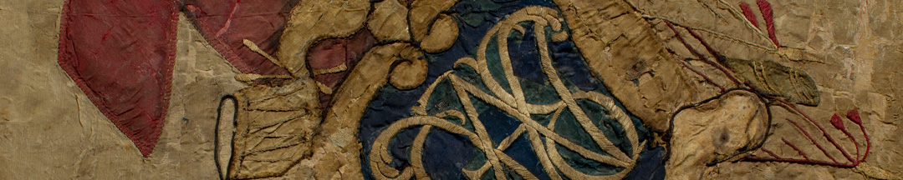
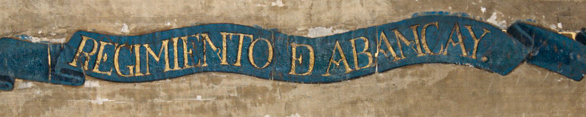
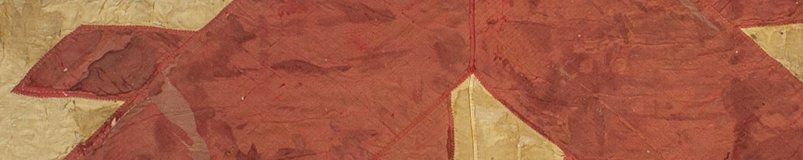

Dos de las banderas capturadas pertenecían al Batallón Fernando VII. A ese modelo se las conocía como batallonas. Llevaban sobre un campo de tafetán de seda blanco aplicada con costura la cruz aspada de Borgoña, en tafetán de seda rojo. En los extremos de la cruz están aplicados escudos bordados en hilos de seda con las iniciales de un lema.

La otra bandera era del Regimiento Abancay y no responde a los modelos que ordenaba la corona. Sobre un fondo de seda blanca está pintado el escudo real de España coronado, sobre una cinta que dice “Viva el Rey”, mientras otra cinta lleva el nombre del regimiento.

Habitualmente se enviaban las banderas enemigas al gobierno central en Buenos Aires, donde el Cabildo las colgaba de su balcón para exhibirlas. Después se enviaban a los distintos templos de vírgenes a los que habían sido prometidas o a la Catedral.

### Datos del objeto
Banderas del Batallón Fernando VII, tafetán de seda con apliques del mismo género bordados en hilos de seda. Aproximadamente es de 1810.
Bandera del Regimiento Abancay, tafetán de seda pintado al óleo. Aproximadamente es de 1810.
