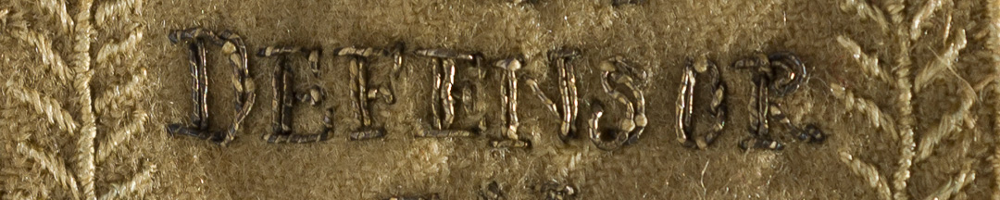
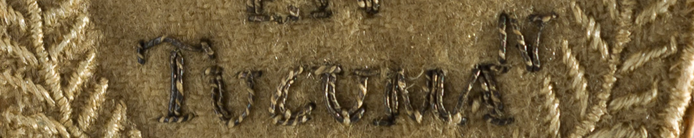

El ejército de Belgrano estaba en inferioridad numérica y con tropas a las que le faltaba entrenamiento. Sin embargo, el 24 de septiembre de 1812 obtuvo una victoria fundamental, que detuvo el avance contrarrevolucionario.

Poco después, un nuevo gobierno, el segundo Triunvirato, decidió entregar premios por Tucumán. Los escudos de paño bordado se habían empezado a usar en las milicias porteñas formadas tras las invasiones inglesas. Eran de paño de lana, como los uniformes, porque es una tela gruesa y resistente, y se cosían a la manga izquierda de la casaca.

Este escudo fue otorgado al comerciante salteño Rudecindo Alvarado. Eran para los oficiales hasta el grado de coronel. Alvarado era teniente de voluntarios de caballería.
Para que brillaran, en hilos de plata se bordó la inscripción, y en hilos de seda posiblemente celestes, desteñidos por el tiempo, las hojas de palma.

### ¿Querés saber más?

El oficial José María Paz contó en sus memorias que en el medio de la batalla de Tucumán, entre el humo de las armas, los sorprendió una nube de langostas:
“buscando al general Belgrano por entre el fuego y la grita de los heridos, que contribuía a hacer más confusa la humareda, el polvo, y una densísima nube de langostas, que casualmente acertaba a pasar por encima, muchos nos creíamos momentáneamente heridos de bala, cuando estos insectos nos daban un golpe por el rostro o por el pecho”.

### Datos del objeto

Escudo de paño de lana con bordados en hilos metálicos y de seda entregado a Rudencio Alvarado tras el triunfo en la Batalla de Tucumán, 1812. Mide 5,2 centímetros por 7,2 centímetros.

