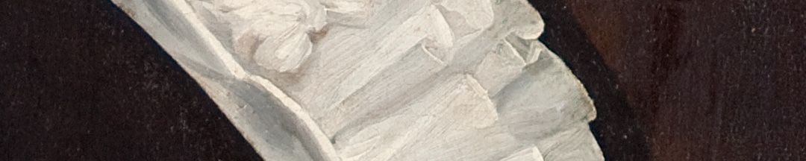
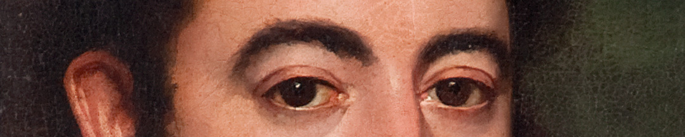

La situación no era fácil para un diplomático rioplatense. En Europa se formó la Santa Alianza, en la que las grandes monarquías que vencieron a Napoleón intentaron que las cosas volvieran a ser como antes de la Revolución Francesa. Condenaron a cualquier estado surgido de una revolución y que adoptara la forma republicana de gobierno.

La misión principal de Rivadavia en el nuevo contexto fue buscar algún candidato para encabezar una monarquía constitucional en el Río de la Plata, pero el proyecto no avanzó. También envió informes sobre la situación social, política y económica en Francia e Inglaterra.

En París conoció a distintos pensadores que le hicieron ir variando su posturas monárquicas hacia otras republicanas. En 1820 regresó a Buenos Aires con esas ideas.

### Datos del objeto
Retrato de Don Bernardino Rivadavia hecho en óleo sobre tela. No se conoce el autor de la obra. Mide 1,12 metros de alto por 0,86 metros de ancho.

