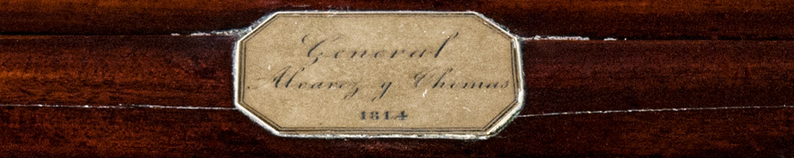
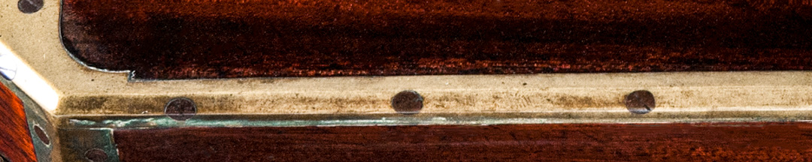

Santa Fe se había autonomizado de Buenos Aires y se incorporó a la confederación que conducía José Artigas, enfrentada con el gobierno central. Álvarez Thomas quería obligarla a obedecer, en especial porque era el paso obligado desde Buenos Aires hacia el interior. Envió a Belgrano a reprimir a la provincia, al frente de unas pocas fuerzas directoriales.

Para evitar el conflicto, Belgrano abrió negociaciones con los santafesinos a través de su subalterno Eustoquio Díaz Vélez. Pero este, que se oponía a Álvarez Thomas, pactó con ellos, apresó a Belgrano y lo envió a Buenos Aires exigiendo el desplazamiento del Director Supremo. Sin apoyos, Álvarez Thomas renunció. Belgrano partió hacia Tucumán, donde empezó a funcionar el congreso para volver a unir a las provincias.

Esta escribanía portátil perteneció a Álvarez Thomas. Es una caja de madera con compartimentos para las plumas y herramientas para tallar sus puntas, para abrecartas y para el papel. Además, contiene frascos para tinta y arenilla, que se usaba como secante. Al abrir la caja se despliega una superficie plana inclinada para escribir sobre ella. Tiene cerradura y también un compartimento secreto. Probablemente sea de origen inglés.

### Datos del objeto

Escribanía portátil de forma octogonal. Está revestida con madera de caoba lustrada y sus aristas están revestidas con láminas de bronce atornilladas. En el centro de la tapa se observa una placa de bronce con la inscripción: "General Alvarez Thomas 1814". En los laterales tiene agarraderas de bronce. Al levantarse la tapa se aprecian tres tableros revestidos con terciopelo violeta que forman un plano inclinado. Tiene un compartimento con un cajón secreto, seis con tapas con perillas de hueso y uno con un espejo con marco de madera.

