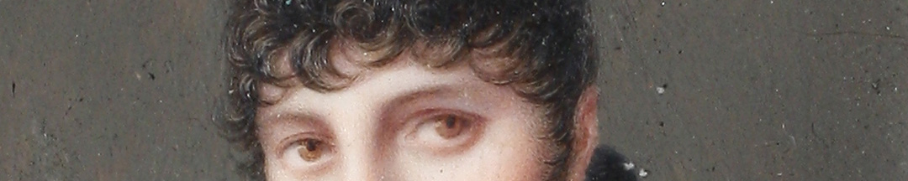
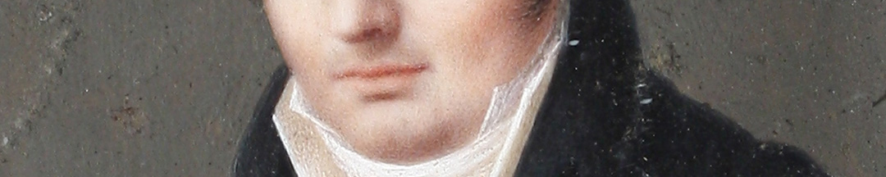

Una alternativa era “*la venida de un príncipe de la Casa Real de España que mande en soberano este Continente bajo las formas Constitucionales que establezcan las Provincias; o el vínculo y dependencia de ellas de la Corona de España, quedando la administración de todos sus ramos en manos de los Americanos*”. Si no conseguían nada debían ganar tiempo y buscar la protección de otra potencia europea.

Los enviados fueron primero a Londres a reunirse con Manuel de Sarratea, otro porteño que estaba tratando de convencer a Carlos IV, padre de Fernando VII y monarca español hasta 1808, de que permitiera ser rey de las Provincias Unidas a otro de sus hijos, Francisco de Paula. Pero no lo logró. Tampoco pudieron acordar con la corona española. Fernando VII preparó una gran expedición restauradora, que en principio iba a dirigirse al Río de la Plata pero finalmente atacó Venezuela en 1815.

Los enviados se hicieron retratar en el viaje. Se supone que Belgrano se hizo pintar en miniatura. Por el peinado, la vestimenta y la pose se piensa que ese retrato fue hecho en el viaje diplomático. Pero en ese momento Belgrano tenía 45 años y seguramente ya no se veía tan joven como lo muestra la miniatura.

### ¿Querés saber más?
La miniatura está atribuida al pintor francés Joseph Alexandre Boichard. Se sabe poco sobre él: que expuso en los salones napoleónicos, es decir, que estuvo activo como artista entre 1801 y 1816. Es posible que tras la caída de Napoleón emigrase a Inglaterra, donde podría haber sido contratado por Belgrano. Pero esa es una incógnita.

Las miniaturas eran, por su tamaño, retratos hechos para la intimidad. Se pintaban sobre una fina placa de marfil de colmillo de elefante o hipopótamo. Se elegía este material porque sobre su superficie pulida se podía calcar un boceto. Luego se pintaba con acuarelas, habitualmente preparadas a la miel con pigmentos de distintos colores. Los pinceles que se usaban eran de cabellos muy finos para alcanzar el máximo grado de detalle.

### Datos del objeto
Retrato de Manuel Belgrano atribuido a Joseph Alexandre Boichard. Mide 6 centímetros de diámetro.

