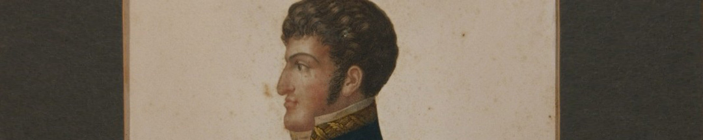
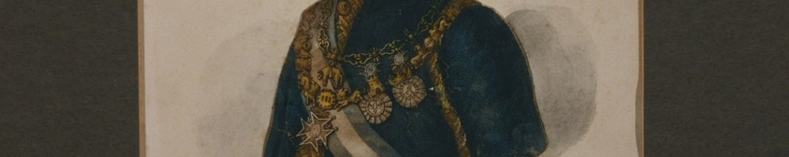

La banda era un símbolo de la Orden de Carlos III, creada por este rey en 1771 para premiar a las personas que se destacaban en servicio de la corona. Los colores se habían inspirado en el manto de la Inmaculada Concepción de María, patrona de la orden.

En este retrato de Fernando VII se perciben bien los colores. El retrato real en las ceremonias y en las sedes de gobierno recibía un tratamiento especial, se lo colocaba en un espacio diferenciado de sus súbditos.

La difusión de las técnicas de grabado, de estampa de imágenes, coincidió con la prisión de Fernando VII por parte de Napoleón. Nunca antes habían circulado tantos retratos de un rey ni en España ni en América. La intensa producción y circulación de retratos de Fernando, que empezó a ser conocido como El Deseado tras su cautiverio, volvió próxima a esa figura alejada.

### ¿Querés saber más?
Durante tres siglos, el gobierno de América estuvo asociado a un cuerpo, el del rey. El dilema que se les presentaba a los revolucionarios era cómo imaginar y materializar un gobierno distinto al del rey. La Revolución Francesa, por ejemplo, recuperando un imaginario de la antigüedad griega y romana, había ideado una figura femenina, conocida como Marianne, que representaba a la libertad y la república.

Belgrano tuvo una actuación clave en este sentido. Fue un creador y comunicador de símbolos.

### Datos del objeto
Grabado anónimo en cobre impreso coloreado a mano. Mide 18 centímetros por 22 centímetros.

