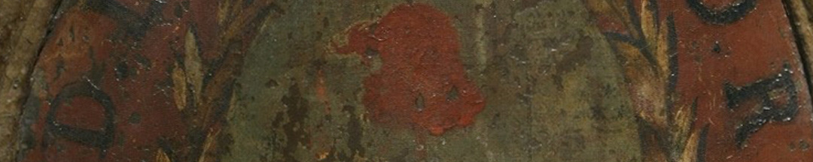
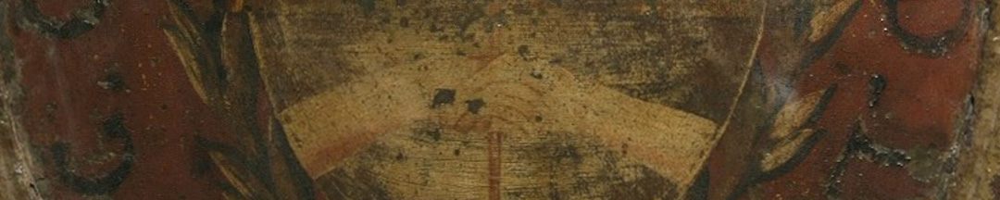

Se creó un escudo nuevo: un óvalo celeste y blanco en el que dos manos sostienen un *gorro de la libertad* sobre una lanza o pica, símbolo de la unión de las provincias y su determinación de defensa. Encima, asoma un sol naciente con cara. El sol era la máxima divinidad adorada por el imperio Inca, y era entonces un símbolo americano. También era una señal de regeneración y de igualdad en el imaginario republicano de la Revolución Francesa, muy influyente en la Asamblea.

En el Museo hay un escudo pintado sobre metal con la fecha de 1813. Está hecho sobre un escudo de la corona española, que se trasluce debajo. Es posible que haya estado en el mismo edificio donde sesionó la Asamblea, porque las siglas que lo rodean, *A.G.C.D.L.P.U.D.R.D.L.P.*, pueden ser una abreviatura de *Asamblea General Constituyente de las Provincias Unidas del Río de la Plata*. Pero como fue donado por el director de la *Administración General de Correos*, también pudo haber sido de esta institución, con las mismas iniciales.

### ¿Querés saber más?
El *gorro de la libertad* identificaba a los libertos, como se les decía a las personas esclavizadas liberadas en la antigua Roma. En las ceremonias de liberación, se les cortaba el pelo y sobre la cabeza se les colocaba un bonete que los distinguía como libertos, llamado *pileus*. Desde el Renacimiento europeo se imagina a la libertad como una mujer con una pica y un gorro. La Revolución Francesa recuperó esta figura femenina para representar la libertad y a la república frente a la monarquía.

Se cree que la borla que cuelga del gorro es de inspiración incaica. La *mascaypacha* era una corona de oro emplumada con flecos de lana rojos que distinguía a algunos de los gobernantes Incas. También tenían como atributo de poder un cetro de oro llamado *topayauri*, del cual colgaba una borla roja.

Los símbolos podían tener muchos significados, y cuántos más grupos pudieran interpelar, como a los pueblos indígenas y a las personas esclavizadas, más convocatoria para la causa patriota.

### Datos del objeto
Escudo pintado al óleo en chapa de cobre enmarcado por una placa de hierro. Mide 57 centímetros por 64 centímetros. Es una obra anónima. Donado por Gervasio Posadas al Museo Público. Ingresó al Museo Histórico el 20-05-1890.

