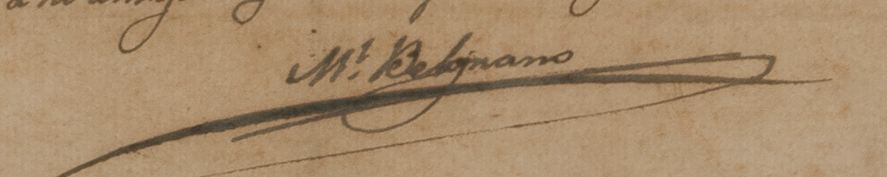
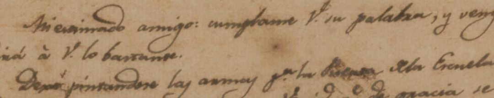

Desde Potosí, el 10 de julio de 1813, Belgrano le escribió una carta al jujeño Teodoro Sánchez de Bustamante. Le encargaba una tarea pendiente: terminar el escudo que debía colocarse en la futura escuela de Jujuy, como ordenaba la Asamblea. Y le decía:
"*Cada vez anhelo más por la apertura de estos establecimientos, y por ver sus resultados, porque conozco diariamente la falta que nos hacen*".

En el Reglamento que redactó para su funcionamiento, también pidió costear “*papel, pluma, tin­ta, libros y catecismo para los Niños de Padres pobres*”. Y prohibió el lujo en la vestimenta para que no hubiera distinción de clases en el aula.

La invasión realista de 1814, que se apoderó de Jujuy y de Salta una vez más, interrumpió el proyecto de las escuelas.

### ¿Querés saber más?

Belgrano diseñó un calendario conmemorativo para las escuelas, reglamentando que debía enseñarse qué había sucedido el 25 de mayo –día del nombramiento de la Junta de gobierno en Buenos Aires–, el 24 de septiembre, –día del triunfo de Tucumán–, y el 20 de febrero, –día de la victoria de Salta–, y que esos días serían asuetos.

Belgrano decía trabajar para ver la patria consolidada. Pero ¿cuál era esa patria? En una carta de 1817, da una pista:
“*Si los Americanos tuviesen una idea de lo que es Nación y no creyesen que todo su patriotismo debe circunscribirse a lo que llaman su Provincia, otra cosa sucedería*”.

###  Datos del objeto

Carta enviada por Manuel Belgrano desde Potosí el 10-07-1813 a Teodoro Sánchez de Bustamante en Jujuy.

