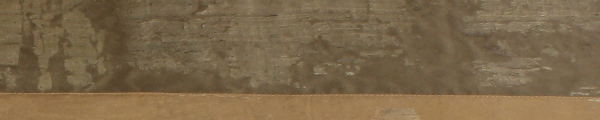
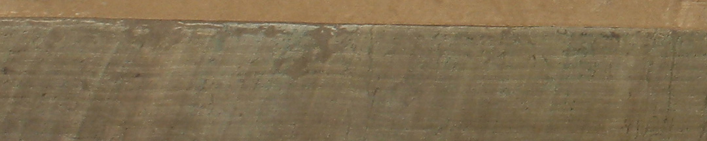

Estaba en Rosario para construir una defensa sobre el río Paraná contra los barcos enemigos. Desde ahí, solicitó al gobierno que estableciera una escarapela nueva, distinta a la roja que utilizaban los dos bandos. En respuesta, el Triunvirato ordenó que todos los ejércitos revolucionarios usaran una escarapela blanca y azul celeste, y abolió la roja. El 23 de febrero Belgrano pidió más medidas para “*confirmar a nuestros enemigos en la firme resolución en que estamos de sostener la independencia de la América*”.

El general nombró Libertad e Independencia a las dos baterías de cañones que montó en las costas del Paraná. El 27 de febrero organizó un acto para su inauguración. Y ahí hizo izar y flamear una nueva bandera. Le comunicó al Triunvirato que “*Siendo preciso enarbolar la bandera, y no teniéndola, la mandé hacer celeste y blanca*”, como los colores de la escarapela.

El Triunvirato le prohibió usarla, ya que no quería demostrar gestos de independencia. Belgrano partió hacia el norte, donde iba a asumir el mando del ejército, y argumentó que no recibió el mensaje. El 25 de mayo de 1812, en Jujuy, organizó el acto del segundo aniversario de la Revolución. En vez de pasear el estandarte real, como se hacía hasta entonces, presentó la nueva bandera de su creación.

La bandera celeste y blanca se difundió rápidamente. El 8 de octubre de 1812 un nuevo Triunvirato, a favor de la independencia, tomó el poder y empezó a utilizarla.

### ¿Querés saber más?

El Museo tiene en su colección desde 1896 una bandera conocida como *de Macha*. Junto a otra con los mismos colores pero invertidos en su orden, estaba oculta tras el marco de un cuadro de la capilla de Titiri, en la actual Bolivia. En 1883 fueron encontradas por su cura. Cuando indagó, dos indígenas ancianos contaron que en su infancia un cura del bando patriota las había escondido.

Se tratan de banderas de la década de 1810. Pudieron haber acompañado tanto a las tropas de Belgrano como a expediciones posteriores al Alto Perú. Que en ambas banderas los colores varíen su orden muestra que importaba lo que comunicaban y no su secuencia.

Las banderas tenían usos concretos. Por su gran tamaño, estas no eran banderas para que portaran en las batallas los *soldados abanderados* de los regimientos, sino que probablemente tuvieran otros usos. Pudieron marcar los puntos donde se ubicaba el general o la artillería en las batallas; o indicar el lugar de encuentro de las tropas tras el combate. También podían ser usadas para colgar como murales en cuarteles o campamentos, o para flamear desde un mástil o un asta.

El Museo Casa de la Libertad en Sucre conserva la bandera blanco-celeste-blanco.

### Datos del objeto
Bandera hecha de tres franjas de tafetán de seda unidas por costura. Tras ser hallada en Macha, fue donada por el Gobierno de Bolivia del 24-06-1896. Mide 2,24 metros x 1,54 metros.

