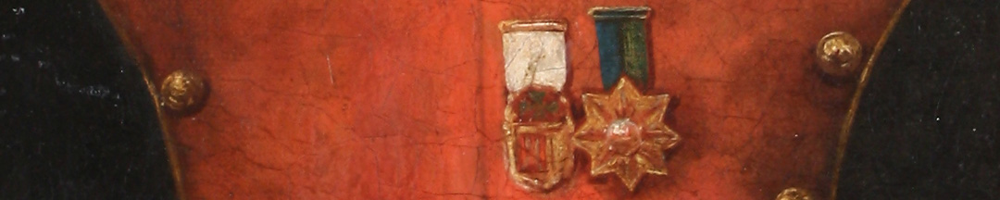
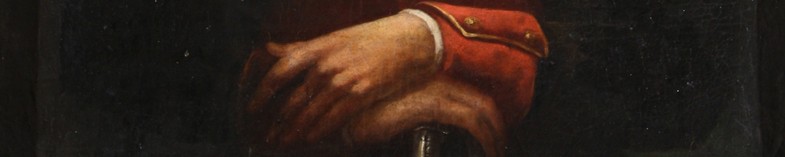

Una de las principales estaba dirigida por una mujer, Juana Azurduy, junto con su marido Manuel Padilla. Ella se destacó en la lucha. En el combate de Villar, Azurduy, al frente de 30 fusileros y 200 indígenas armados con palos y hondas, logró dispersar una columna enemiga y capturar con sus propias manos una bandera realista.
Cuando esa noticia llegó a Buenos Aires, le otorgaron el grado de teniente coronel de milicias a “la amazona Juana Azurduy”.

El apodo de Amazona se lo había dado Belgrano que, a pesar de estar en contra de la presencia de mujeres en los ejércitos porque sostenía que atentaba contra la disciplina, hizo una excepción con Azurduy.

Más adelante, Azurduy fue reconocida por Simón Bolívar, quien le otorgó el cargo de Coronel.

### ¿Querés saber más?
El caso de Juana Azurduy es excepcional porque tomaba parte de la acción de la batalla e incluso la conducía. Pero las mujeres eran un engranaje clave en la vida cotidiana de los ejércitos. Realizaban tareas de cuidado –cocina, enfermería, costura–, y también de espionaje.

Este retrato de Juana Azurduy ingresó en la colección del Museo en 1895 como "copia del que existe en Chuquisaca". El pintor Antonio Estrada realizó dos cuadros, uno para el Museo Histórico Nacional y otro para la Iglesia de la Merced.

Las representaciones de Juana Azurduy desde mediados del siglo XIX tienen elementos en común: viste uniforme militar, lleva un peinado recogido, posa con su sable y su expresión es severa. Los escritos de sus contemporáneos le atribuían rasgos del género masculino.

### Datos del objeto
Retrato de Juana Azurduy hecho en óleo sobre tela por Antonio Estrada. Mide 62 centímetros de alto y 50 centímetros de ancho.

