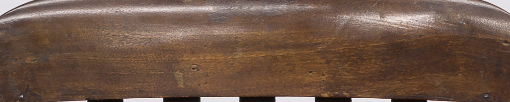
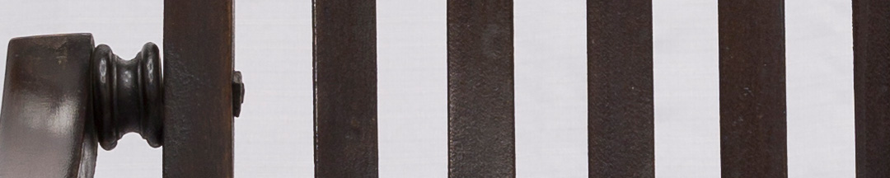

Ya en 1816 el gobierno de La Rioja fue desplazado por una facción rival. Tropas del Ejército Auxiliar del Perú intervinieron para restablecer la situación previa. Meses más tarde hubo una agitación armada en Córdoba, donde grupos favorables a Artigas exigieron que se enviaran auxilios a Santa Fe, ante la noticia de que fuerzas de Buenos Aires la habían invadido. El gobernador cordobés pidió ayuda y Belgrano envió tropas que restauraron el orden.

Otro levantamiento ocurrió en diciembre en Santiago del Estero, Lo encabezaba Juan Francisco Borges y buscaba la autonomía provincial. Otra vez Belgrano mandó tropas para reprimir. Tras vencer a los rebeldes, el general decidió usarlos de ejemplo para disuadir nuevos intentos. Borges fue condenado a muerte y fusilado el 1º de enero de 1817.

Pero no fue el final. En 1818 Belgrano fue convocado para atacar Santa Fe, que seguía negándose a obedecer al Directorio. Le parecía que era una guerra sin mucho sentido, pero igual mandó hombres en una ofensiva, que terminó sin éxito.

Cuando se desplazaba al frente de sus tropas, el general utilizaba esta silla de campaña.

### ¿Querés saber más?
Las varillas del respaldo de la silla están ligeramente vencidas, lo cual da cuenta de que fue usada. Es probable que haya sido hecha en Inglaterra, donde la industria de *muebles de campaña* se desarrolló aceleradamente a partir del avance colonial británico.

El mobiliario de campaña fue fundamental durante las guerras revolucionarias. Los oficiales y generales desplegaban sillas, mesas y escribanías en sus tiendas de campaña.
 
Tan importantes eran en la cotidianidad militar, que Belgrano le escribió a San Martín una carta, en 1814, diciéndole: "*Deseo mucho hablar con usted de silla a silla para que tomemos las medidas más acertadas y formando nuestros planes, los sigamos sean cuales fueren los obstáculos que se nos presenten*". Tal vez, Belgrano imaginó tener la conversación desde esta silla. 

### Datos del objeto
Silla de cedro, plegadiza con posabrazos. Mide 0,90 metros de alto por 0,42 metros de ancho. En el respaldo tiene siete barrotes y el asiento, ocho.

