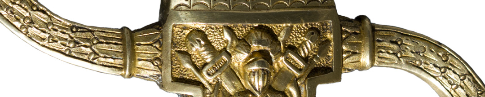
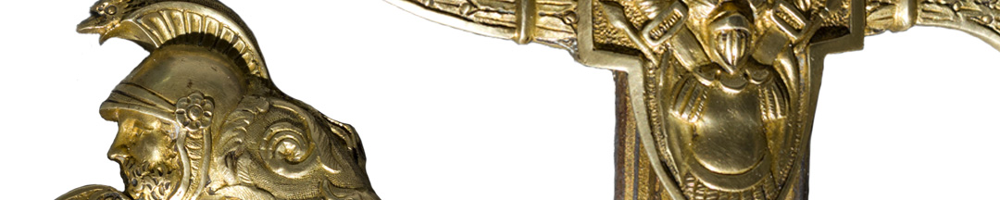

Pero en noviembre de ese año, un motín removió al gobernador directorial de esa provincia y llevó al poder a Bernabé Aráoz, que había tenido varios conflictos con Belgrano a lo largo del tiempo. El general terminó preso, pero le permitieron partir. Agotado, emprendió el largo viaje a Buenos Aires, por última vez.

No solo Belgrano se derrumbaba: en enero de 1820 el Ejército que había mandado se negó a continuar la guerra civil y se dispersó. En febrero los santafesinos y entrerrianos vencieron a Buenos Aires y obligaron al Directorio a disolverse. También se desmoronó la Liga de los Pueblos Libres. El sistema creado por la Revolución de Mayo había llegado a su fin.

Lo mismo le ocurrió a Belgrano. Ya en Buenos Aires, enfermo, redactó su testamento el 25 de mayo de 1820. Menos de un mes después, el 20 de junio, murió, en la misma casa donde había nacido.

### ¿Querés saber más?
Este sable corvo perteneció al general salteño Rudencido Alvarado. Su hija lo donó al Congreso Nacional en 1881, y de allí pasó a conformar la colección del Museo desde septiembre de 1890.

Según narró la hija de Alvarado al hacer la donación, antes de pertenecer a su padre, quien tuvo una destacada actuación en la guerra de independencia, había sido de Martín Miguel de Güemes, quien a su vez lo había recibido de Manuel Belgrano.

Sin embargo, investigaciones hechas por miembros de Gendarmería Nacional sostienen que fue Miguel Riglos quien se lo ofreció a Güemes y que no hay documentación para afirmar que el sable haya pertenecido a Belgrano. Por su parte, el Instituto Belgraniano plantea que tampoco hay documentación para sostener lo contrario. Se trata, en definitiva, de un interrogante que difícilmente pueda resolverse.

Es un sable *de honor* que, aparentemente, recuerda las campañas de Napoleón Bonaparte en Egipto a fines del siglo XVIII. Estos sables de lujo eran encargados especialmente a famosos espaderos y era frecuente que fueran obsequiados como muestra de gratitud a alguna personalidad militar.

### Datos del objeto
El sable tiene hoja de acero corva, con empuñadura de cachas de nácar, de un solo filo.La vaina es dorada, con dos abrazaderas y anillas, con tres aplicaciones de bronce que representan escenas de guerra. El resto está repujado.

