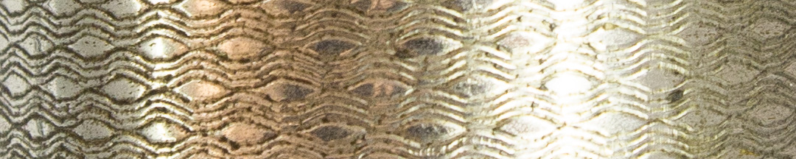

Esto se debía a un cambio en la estrategia militar de los independentistas, impulsado por el nuevo director supremo elegido en 1816 por el Congreso: Juan Martín de Pueyrredón. Desestimó la propuesta de organizar una cuarta expedición al Alto Perú, favorecida entre otros por Belgrano, y se decidió por una táctica defensiva en el Norte. Martín Miguel de Güemes y sus gauchos se encargarían de custodiar la frontera con los realistas del Alto Perú, a través de la guerra de guerrillas. Y la gran apuesta sería el proyecto de José de San Martín de cruzar los Andes, atacar a los realistas en Chile y de allí avanzar sobre el Perú, baluarte español en América del Sur.

Los recursos del Directorio se destinaron principalmente a la campaña de San Martín. Por eso, las tropas al mando de Belgrano eran escasas, recibían pocas raciones de carne y se encontraban muy mal pagas. Igualmente, Belgrano se preocupaba por controlar que sus hombres mantuvieran la disciplina y estuviesen listos para la acción.

### Datos del objeto
Timbre que usó el General Manuel Belgrano y, posteriormente, los gobernadores de Tucumán. Mide 11,1 centímetros de alto.

