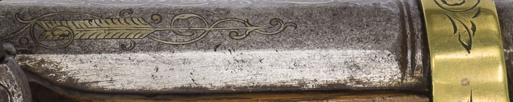
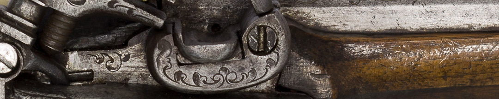

El general nunca se casó. Aunque se esperaba que los varones de la elite lo hicieran, la presión sobre ellos era mucho menor que sobre las mujeres.

Helguero no es el único vínculo amoroso que se conoce de Belgrano. Al comenzar el siglo XIX empezaron un amorío con la joven María Josefa Ezcurra. Pero en 1803 a ella le impusieron casarse con un primo. Tras la Revolución de Mayo, su esposo –que era español y opositor a la Junta– regresó a Europa. Y entonces se reinició el romance. En 1812, María Josefa acompañó a Belgrano en su campaña al Norte. Fruto de este vínculo, nació un hijo que criaron la hermana menor de Josefa, Encarnación Ezcurra, y su cuñado Juan Manuel de Rosas. Cuando fue mayor se le reveló quién era su padre y desde entonces adoptó el nombre Pedro Rosas y Belgrano.

### ¿Querés saber más?
Esta pistola no era para la función militar sino de uso privado. Es una pistola para defensa personal que se llevaba en los bolsillos, con un mecanismo de seguridad para evitar que se accionara sola. Tiene grabado el nombre de su dueño: “*General M.J. Belgrano*”. Es probable que sea un regalo del Cabildo porteño en reconocimiento por su accionar.

Este modelo de pistola se fabricaba en las fraguas de Ripoll, localidad catalana con minas de hierro. Se puede identificar por su empuñadura, por su decoración y por el tipo de llave a la española o *de Miquelete*.

Por delante se colocaba la pólvora, luego un retazo de tela y por último la bala. Con la varilla que está encastrada en la parte inferior se presionaba para compactar estos elementos. Luego, cuando se pulsaba el gatillo se hacía una chispa por impacto entre el metal y un fragmento de pedernal sujetado por el *tornillo pedrero*, y rematado por una argolla. Esa chispa encendía la pólvora y producía el disparo.

A estas pistolas se la llama *cachorrillos*. Se discute si es por su empuñadura hecha de *cachas*, piezas de madera encastradas, o por su martillo percutor que parece tener forma de cabeza de perro.

