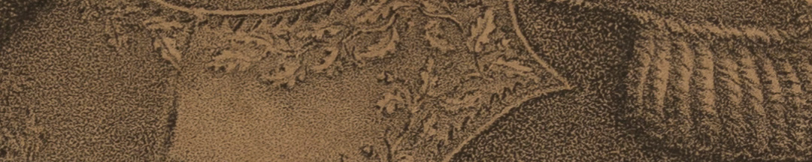
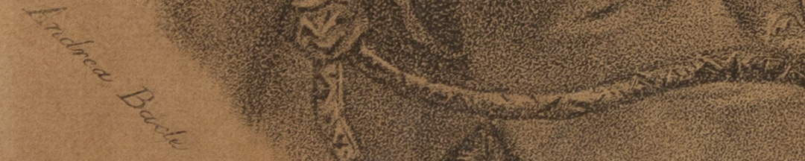

Macaire se inspiró en los retratos londinenses de Belgrano, uno conservado por su familia y otro por Rivadavia. Pero introdujo variaciones: en vez de un traje de civil, usa un traje militar, y su cara tiene una expresión risueña.

La inscripción que incluyó debajo, dice:

“*Jamás admitió otra recompensa que el honor de haber servido bien a su patria y murió pobre después de haber contribuido a salvarla por medio de victorias inmortales, dejando un gran ejemplo a Buenos Ayres*”.

### ¿Querés saber más?
En el Río de la Plata, la introducción de la litografía permitió un salto en la circulación de imágenes y en los usos visuales de la política.

La litografía tenía varios pasos. Primero, se dibujaba sobre una piedra caliza pulida. Segundo, remarcaba el dibujo con una tinta grasa, y se aplicaba una sustancia fijadora. Tercero, se humedecía con agua la superficie y se entintaba con más tinta grasa la piedra, y así esta solo se adhería a la tinta previa. Cuarto y último, se colocaba el papel sobre la piedra y se estampaba con una prensa, ejerciendo presión.

### Datos del objeto
Esta litografía fue hecha por Andrienne Macaire y Bacle y Compañía, aproximadamente en 1828. Mide 48 centímetros de alto y 40 centímetros de ancho.

