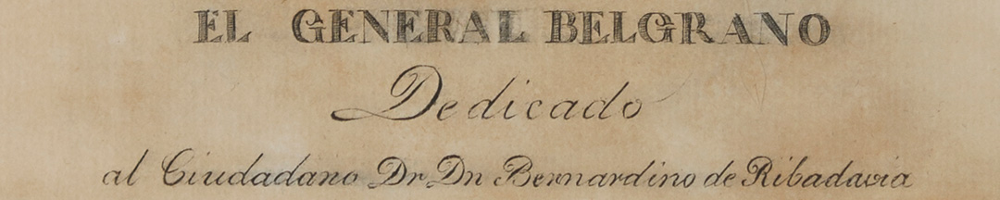
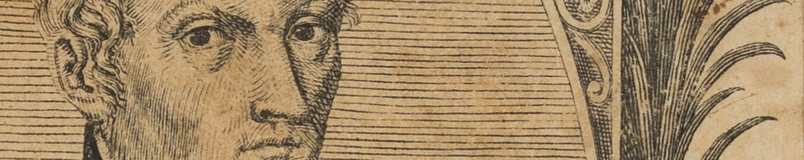

En 1821, para acompañar un homenaje fúnebre, Núñez hizo otro retrato grabado, con un rostro más avejentado, con la colaboración del grabador francés José Rousseau. Ambos enseñaban en la escuela de dibujo del Consulado de Comercio, que Belgrano había impulsado.

La vida de este artesano estuvo surcada por los cambios políticos causados por la revolución y por la guerra. De hacer estampas religiosas, pasó a retratar a San Martín, a Belgrano y a Rivadavia. Los retratos de estos personajes creados por Núñez de Ibarra fueron los primeros que circularon en el Río de la Plata.

El arte del grabado posibilita la multiplicación, porque su operación de impresión se puede repetir. Se dibuja con una herramienta filosa sobre una plancha metálica. La tinta se aloja en los surcos del dibujo y cuando la plancha pasa por una prensa, se graba en papel.

### ¿Querés saber más?
Belgrano tenía trato personal con Núñez de Ibarra. En el trabajo de este, Belgrano veía que los proyectos de reforma que le había costado impulsar bajo la colonia cobraban un nuevo impulso tras la revolución.

En 1812, cuando Núñez de Ibarra propuso abrir un taller de fabricación de letras de imprenta, Belgrano apoyó el proyecto:
“*Apreciadísimo Amigo, Los fines a que se dirigen sus conocimientos son grandes, y muy útiles en las actuales circunstancias, para formar hombres. [...] Conozco que como verdadero hijo de la Patria, procura Usted los adelantamientos de todos sus naturales*”.

### Datos del objeto
Nro. 1043:
Retrato del General Manuel Belgrano grabado en cobre impreso de Manuel Pablo Núñez de Ibarra hecho en 1819. Mide 36 centímetros de alto y 31 centímetros de ancho.

Nro. 1048:
Retrato del General Manuel Belgrano grabado en cobre impreso de Manuel Pablo Núñez de Ibarra y José Rousseau hecho en 1821. Mide 26 centímetros de alto por 21,5 centímetros de ancho.

