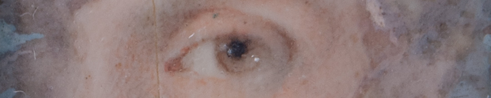
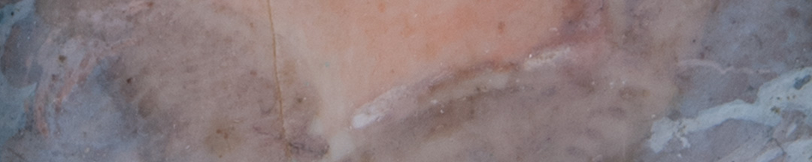

¿Cuál de las dos prácticas habrá expresado esta mirada? Quizás una sucedió a la otra. Belgrano nunca formalizó sus relaciones afectivas. Según los descendientes que donaron la pieza al museo, perteneció a la hija natural de Belgrano, Manuela Mónica, que la solía portar abrochada en su ropa.

Está atribuida al artista francés Jean-Philippe Goulu, que migró a Sudamérica, instalándose primero en Río de Janeiro en 1816 y en Buenos Aires en 1824. No se sabe si coincidió con Belgrano.

### ¿Querés saber más?
Paradójicamente, por su diminuto tamaño las miniaturas se hacían sobre láminas de marfil, extraídas de los colmillos de animales colosales, elefantes e hipopótamos, comercializados desde Asia y África. Se usaban también pinceles de pelos finos de marta para lograr el detalle. Y los pigmentos de las acuarelas se preparaban con miel de abejas.

### Datos del objeto
*Ojo izquierdo del Gral Manuel Belgrano*, miniatura sobre marfil pintada en *gouache* atribuida a Jean-Phillipe Goulu. Mide 3 centímetros de alto y 2 centímetros de ancho.

