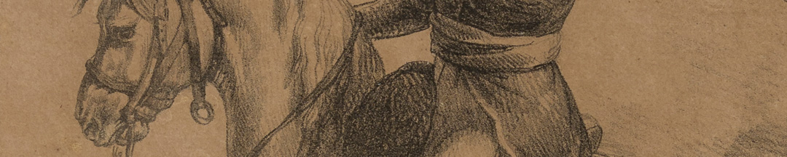
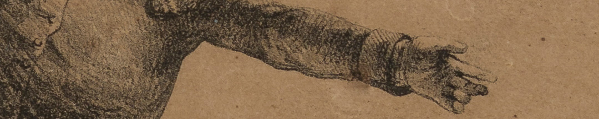

El encargo lo hizo Ambrosio Cramer, un oficial francés que había emigrado a Sudamérica tras la derrota de Napoleón. Se integró al Ejército de los Andes y luego al Ejército Auxiliar del Perú, y así conoció a ambos generales. Su objetivo al pedirlos era comercial. Un día después de la muerte de Belgrano se anunció en la Gazeta de Buenos Ayres que los retratos estaban en venta.

### Datos del objeto
Este retrato de Manuel Belgrano es una litografía hecha por Théodore Géricault. Mide 51,5 centímetros de alto y 41 centímetros de ancho. Fue hecho aproximadamente en 1818.

