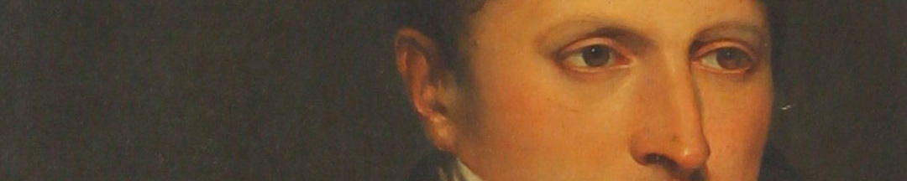
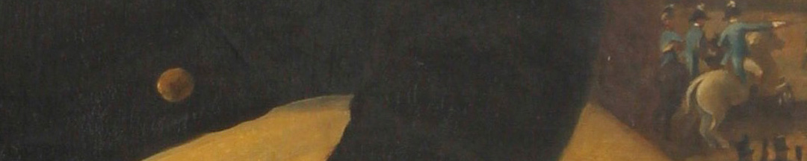

Se cree que tanto este, como otro retrato de busto, que está en la colección del Museo Nacional de Bellas Artes, llegaron a Buenos Aires desde Londres en 1822. Esto puede ser un indicio del tiempo y el trabajo que llevaba hacer un retrato. Carbonnier había adherido a Napoleón y tras su derrota, mudó su taller a Londres. Coincidió con la llegada de Belgrano a esa ciudad.

Belgrano eligió ser representado en sus dos facetas. En primer plano, como funcionario, con un elegante traje de civil y un peinado a la moda. Y también como general, dirigiendo la batalla que se ve a través de una ventana.

En la escena militar del cuadro hay varias banderas blancas y celestes flameando. Como son banderas solo de dos franjas, una celeste y otra blanca, en coincidencia con la nota que escribió al crearla en 1812, algunos autores han sostenido que este era el diseño antes del de tres franjas que se empezó a usar poco después. Pero no se lo puede saber con certeza. Como curiosidad, Belgrano hizo el viaje a Europa con Rivadavia, quien había sido secretario del Triunvirato que en 1812 desautorizó su creación de la bandera.

### ¿Querés saber más?
José María Paz, oficial del Ejército del Norte, señala en sus memorias:
“*Cuando Belgrano volvió al ejército el año 16, después de su viaje a Londres, había variado; vino decidido por la forma monárquica en la familia de los incas, sus maneras eran algo aristocráticas, y vestía como un elegante de París o Londres. [...] En los años de 1812, 13 y 14, el general Belgrano vestía del modo más sencillo, hasta la montura de su caballo tocaba en mezquindad. Cuando volvió de Europa en 1816 era todo lo contrario, pues aunque vestía sin relumbres, de que no gustaba generalmente, era con un esmero no menor del que pone en su tocado el elegante más refinado, sin descuidar la perfumería. Con sus opiniones políticas habían variado sus gustos, porque de republicano acérrimo que era al principio, se volvió monarquista claro y decidido*".

El comerciante tucumano José Celedonio Balbín, tuvo una impresión distinta a la de Paz:

“*Se hallaba siempre en la mayor escasez, así es que muchas veces me mandó pedir cien o doscientos pesos para comer. Lo he visto tres o cuatro veces en diferentes épocas con las botas remendadas, y no se parecía en esto a un elegante de París o Londres*”.

### Datos del objeto
Retrato de Manuel Belgrano hecho al óleo por Fortunato Fontana en 1941. Mide 1,15 metros de alto y 0,90 metros de ancho.

