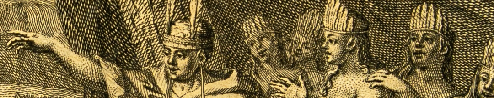
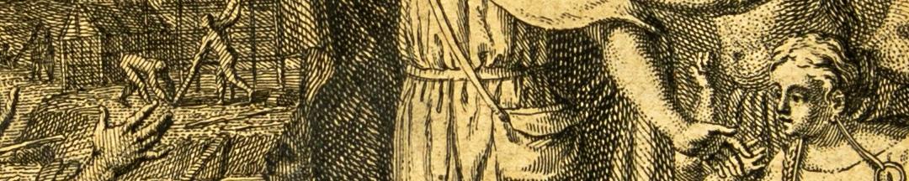

 En una primera etapa de la colonia, hubo una política de integración hacia la nobleza incaica que luego se suprimió. Garcilaso sostenía que tanto el sistema incaico como el momento inicial de alianza entre españoles e indígenas eran ejemplos de *buen gobierno*, frente a un posterior *mal gobierno* que excluía y reprimía a la nobleza inca.

Más tarde, la nobleza indígena en el Perú del siglo XVIII encontró en Garcilaso un sostén para su identidad. Tupac Amaru II lo leía, y cuando su rebelión fue reprimida se prohibió el libro por ser la fuente “*donde han aprendido esos naturales muchos errores perjudiciales*”.

Pero los revolucionarios criollos rescataron la obra de Garcilaso. En 1814, por iniciativa de San Martín, se abrió en Córdoba una suscripción para reimprimirla. El argumento era: “*Ningún tiempo como el presente para la lectura de esta importante obra. Salgamos de esa ignorancia vergonzosa en que hemos vivido acerca de las costumbres, extensión y riqueza de nuestro suelo*”. Se reivindicaba así el pasado americano.

El libro estaba ilustrado con grabados, como el que representa el mito de la pareja fundadora de la dinastía incaica: el Inca Manco Cápac y la Colla Mama Ocllo. Aparecen vestidos, reuniendo a *salvajes* desnudos, y enseñándoles la construcción del Cuzco, futura capital del imperio.

### Datos del objeto
*El primer Inca Manco Capac y la Reina Coya Mama Ocllo* grabado dibujado por Gabriel Francois Louis Debrie, y pasado a plancha de cobre por el grabador Jacob Folkema, grabador. Fue impreso en Amsterdam por Jean Frederic Bernard en 1737.

