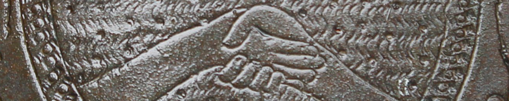
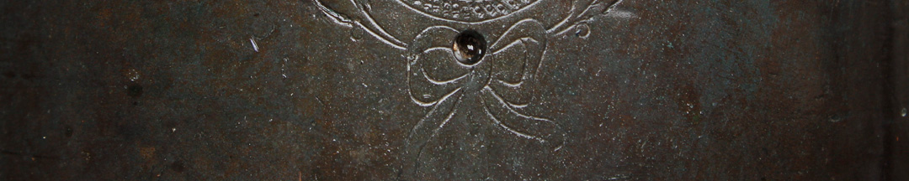

En una sesión secreta del 6 de julio de 1816, Belgrano presentó al Congreso de Tucumán su plan. La restitución sería un acto de *justicia* y la “*sola noticia estallará un entusiasmo general de los habitantes del interior*”. En una carta contó:

 “*Yo hablé, me exalté, lloré e hice llorar a todos al considerar la situación infeliz del país. Les hablé de la monarquía constitucional con la representación de la Casa de los Incas: todos adoptaron la idea*”.

Una tercera campaña revolucionaria al Alto Perú había sido derrotada en 1815, y se buscaba con el proyecto la adhesión de los pueblos indígenas de esa región para conseguir la esquiva victoria. Las rebeliones andinas de 1780 habían activado el mito del regreso de un Inca liberador, y también Castelli había sido señalado como inca en 1810. Se supone que el candidato de Belgrano era un sobrino de Tupac Amaru, preso de los españoles.

El plan se basaba en la reivindicación del pasado indígena que existía en el momento. Una señal es que en 1815 se haya elegido llamar a un cañón *Atahualpa*, el último gobernante Inca ejecutado por los españoles.

Pese al apoyo de muchos diputados, el sanjuanino Oro frenó la iniciativa en el Congreso, al sostener que para “*declarar la forma de gobierno, era preciso consultar previamente a los pueblos*”.

### ¿Querés saber más?
Es probable que el cañón Atahualpa haya sido realizado en la Fábrica de fusiles instalada en Buenos Aires. Ya en el primer taller instalado allí se habían fabricado en 1812 dos morteros, el *Tupac Amaru*, en homenaje al líder de la gran rebelión andina (que a su vez había recuperado el nombre del último rebelde inca del siglo XVI), y el *Mangoré*, por el cacique chaná-timbú que había confrontado a la primeras primeras expediciones conquistadoras que remontaron el río Paraná en la década de 1520.

Pero aunque las reivindicaciones del pasado indígena estaban extendidas, no todos apoyaron el proyecto de Belgrano. En Buenos Aires, la única ciudad de las Provincias Unidas donde había periódicos que discutían, el tema generó un debate.

*El Censor* lo apoyó. Sostuvo que los criollos debían identificarse con los *indios*,

“*porque nacimos en territorio americano, somos descendientes de los desposeídos, y hermanos de los existentes*”.

Pero *La Crónica Argentina* lo criticó, defendiendo a la república contra la monarquía. Y también advirtió:

“*¿Pensamos engañar a los indios para que nos sirvan en asegurar nuestra libertad, y no tememos que nos suplanten en esta obra?, ¿será prudencia excitar la ambición de esta clase, oprimida por tanto tiempo (...)?*”

### Datos del objeto
Cañón de bronce fundido en Buenos Aires el 1° de diciembre de 1815. Lleva grabado el escudo y su nombre, El Atahualpa. Es de avancarga y su ánima está rayada. Mide 1,49 metros y en el muñón derecho lleva grabado el peso del cañón: “*P° 668 LS*”.
