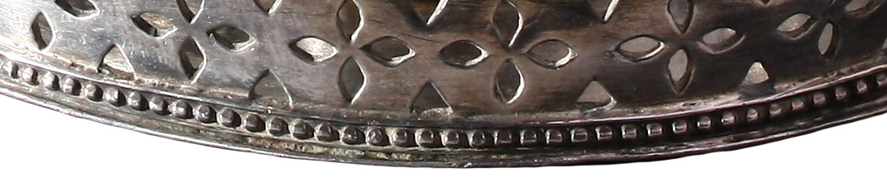
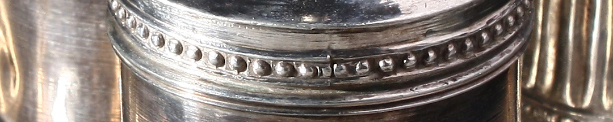

Este reforzaba una identidad americana por sobre las locales, y dejaba abierta la posibilidad de que se incorporaran otros pueblos: los altoperuanos e incluso Chile, que en ese momento estaban bajo dominio realista; los litoraleños, confederados bajo el liderazgo de Artigas; y el Paraguay, independiente en los hechos. Incluso parte del Perú, ya que algunos soñaban con una capital en Cuzco, la ciudad incaica.

La declaración decía que era “*voluntad unánime e indudable de estas provincias romper los violentos vínculos que las ligaban a los reyes de España, recuperar los derechos de que fueron despojadas, e investirse del alto carácter de una nación libre e independiente del rey Fernando VII, sus sucesores y metrópoli*”. El 21 de julio, ante críticas de que se negociaría con los portugueses, se agregó “*y de toda otra dominación extranjera*”.

Se tomaba a la dominación española como una imposición por la fuerza y no el fruto del consentimiento legítimo, por lo cual se tenía derecho a resistirla y disolverla, y a restituir una soberanía independiente a los pueblos como un acto de justicia.

Se considera que con esta escribanía de plata fueron redactadas las actas del Congreso de Tucumán.

### ¿Querés saber más?
Las provincias que enviaron diputados fueron Tucumán, Salta, Jujuy, Santiago del Estero, Córdoba, Catamarca, La Rioja, San Juan, Mendoza, San Luis, Buenos Aires, y algunas del Alto Perú: Charcas, Chichas y Mizque, hoy pertenecientes a Bolivia.

Corrientes, Misiones, Santa Fe, Entre Ríos y la Banda Oriental, decidieron no enviar representantes. Se habían organizado confederadamente en la *Liga de los Pueblos Libres* y nombrado a un *Protector*, Artigas. Estaban enfrentadas a las pretensiones de instaurar un gobierno central.

El Congreso dispuso que se imprimiera la declaración y el juramento de la independencia en hoja suelta. Se publicaron 1500 números solo en castellano, y 1500 bilingües, 1000 en castellano-quechua y 500 en castellano-aymara, que fueron enviadas a Belgrano para que las distribuya en el norte y en el Alto Perú. No se tradujo oficialmente al guaraní, como sí habían ocurrido con los decretos de la Asamblea del Año XIII, lo cual expresa una resignación ante un espacio sujeto al Paraguay y a la política artiguista.

### Datos del objeto

Escribanía de plata labrada compuesta de una bandeja y cuatro recipientes. Uno con tapa para conservar la tinta; otro para la tinta en uso, con algunos orificios para las plumas; y uno para la arenilla secante.Otro recipiente es más alto, y cuenta con orificios para las plumas. Perteneció al diputado jujeño Teodoro Sánchez de Bustamente.

