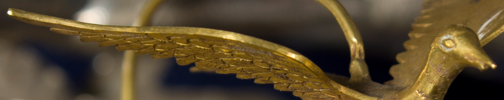
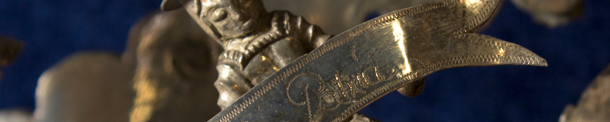

Belgrano ingresó en Potosí en junio de 1813. Varias damas patriotas de esa ciudad minera le obsequiaron una notable obra de platería y orfebrería conocida como la Tarja de Potosí. Es un homenaje al general, a Buenos Aires y a Sudamérica. Se celebra la libertad, la unión americana y su tradición indígena.

El águila, un símbolo de la corona española adoptado por la Potosí colonial, se transforma en la paloma del escudo de la ciudad de Buenos Aires. El Cerro Rico potosino le agradece al Río de la Plata. En la cima hay un indio coronado. Está representado como en Europa se caracterizaba a los diversos pueblos indígenas, con el torso desnudo y con adornos de plumas. Sostiene una daga y una lanza rematada por el gorro de la libertad. Está dando un significativo paso adelante.

Belgrano envió la Tarja a Buenos Aires, acompañada por una lista de las 77 diputadas que lo distinguieron. Por su tamaño viajó desarmada y fue compuesta en la capital por el platero altoperuano Juan de Dios Rivera. El regalo llegó en diciembre, pero el clima era poco festivo por las noticias de la derrota de Belgrano en Vilcapugio y Ayohuma.

### ¿Querés saber más?
Belgrano estuvo muy activo en Potosí. Organizó el juramento de las autoridades potosinas a la Asamblea del Año XIII y a la “unión y libertad de la América del Sud, y Provincias del Río de la Plata”. Se expuso la Tarja, mencionada en una crónica como “un cuadro con marco de plata que representaba la unión de las Provincias del Río de la Plata. Este cuadro estaba bajo un dosel con guardias. El general Belgrano llevaba la bandera de color azul y blanco, se presentó en el tablado de la plaza mayor y a todos los concurrentes les tomó el juramento en los idiomas castellano, quichua y aymara”. La Tarja fue tratada con el mismo ritual que en las ceremonias coloniales se le daba al retrato de los reyes españoles.

También recibió a un cacique ava guaraní-chiriguano llamado Cumbay que llegó a Potosí para coordinar la participación de sus guerreros en el bando patriota. Belgrano lo hizo sentar a su lado en un baile al que “asistieron las principales damas de Potosí todas vestidas de raso blanco y celeste, y todas con una banda con la inscripción siguiente: ‘Libertad o muerte’”, según un testigo.

Tras su derrota y antes de retirarse, Belgrano quiso volar por los aires la Casa de la Moneda, central en Potosí. Pero la pólvora no se activó.

### Datos del objeto
Tarja labrada en plata y oro hecha en Potosí, 1813. Mide 1,70 metros de alto por 1,03 metros de ancho.

